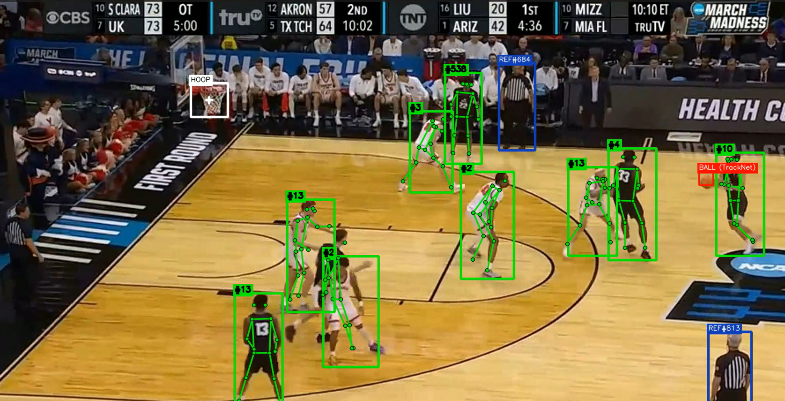

# UVA Men's Basketball Computer Vision Analysis

## Project Overview

A basketball analysis pipeline that detects, tracks, and annotates players, referees, the basketball, and the hoop from game footage using a fine-tuned YOLO11s model with ByteTrack multi-object tracking, TrackNet heatmap-based ball detection with test-time augmentation, velocity-aware ball validation with head-lock rejection, Kalman-filtered ball trajectory smoothing, auto-detected court ROI, pose estimation, jersey number OCR, stability-gated temporal interpolation, and automatic team classification.



**Team Members:**
- Jackson Kennedy
- Nathan Wan
- Nathan Todd
- Hudson Noyes
- James Sweat

---

## Pipeline Architecture

```
                              ┌─────────────────────────────────┐
                              │         VIDEO INPUT             │
                              │   1280x720 @ 60fps (mp4)        │
                              └───────────────┬─────────────────┘
                                              │
                              ┌───────────────▼─────────────────┐
                              │        FRAME SCHEDULER          │
                              │  Process every frame            │
                              │  (configurable frame_skip=1)    │
                              └───────────────┬─────────────────┘
                                              │
          ┌───────────────────────────────────┼──────────────────────┐
          │                                   │                      │
   ┌──────▼──────────────┐      ┌─────────────▼──────────────┐      │
   │  FINE-TUNED YOLO11s │      │     TRACKNET (PRIMARY)     │      │
   │  Detection+Tracking │      │  3-frame heatmap regression │      │
   │  4 cls + ByteTrack  │      │  11-ch input (RGB + motion) │      │
   │                     │      │  Runs EVERY frame for        │      │
   │  Players, Refs,     │      │  sliding window sync         │      │
   │  Hoops              │      │  TTA (horizontal flip avg)   │      │
   └──────┬──────────────┘      └─────────────┬──────────────┘      │
          │                                   │                      │
          │                        ┌──────────▼───────────────┐      │
          │                        │     BALL VALIDATION      │      │
          │                        │  Court ROI (auto) →      │      │
          │                        │  Velocity-aware teleport │      │
          │                        │  (cold-start pathway) →  │      │
          │                        │  Backboard → Temporal    │      │
          │                        │  consistency → Head-lock │      │
          │                        └──────────┬───────────────┘      │
          │                                   │                      │
          │                        ┌──────────▼───────────────┐      │
          │                        │   KALMAN FILTER          │      │
          │                        │   4-state constant-vel   │      │
          │                        │   Velocity-aware reset   │      │
          │                        └──────────┬───────────────┘      │
          │                                   │                      │
          └────────────────────────┬──────────┘──────────────────────┘
                                   │
          ┌────────────────────────┼──────────────────────────────┐
          │                        │                              │
   ┌──────▼──────────────┐  ┌─────▼────────────────┐  ┌─────────▼──────────────┐
   │  PLAYER PROCESSING  │  │    BALL TRACKING     │  │   POSE ESTIMATION      │
   │                     │  │                      │  │                        │
   │  Re-ID (jersey+prox)│  │  BallTracker (Kalman)│  │   YOLO11n-pose         │
   │  Jersey OCR         │  │  BallInterpolator    │  │   Every processed      │
   │  Team classify      │  │  (gap filling)       │  │   frame, cached        │
   │  Velocity tracker   │  │                      │  │                        │
   └──────┬──────────────┘  └──────────┬───────────┘  └───────────────┬────────┘
          │                            │                              │
          └────────────────────────────┼──────────────────────────────┘
                                       │
                              ┌────────▼────────────────────────┐
                              │         ANNOTATION              │
                              │  Draw boxes, skeletons, labels  │
                              │  Team colors, jersey numbers    │
                              └────────┬────────────────────────┘
                                       │
                              ┌────────▼────────────────────────┐
                              │      INTERPOLATION BUFFER       │
                              │  20-frame look-ahead            │
                              │  Outlier rejection (1-3 spikes) │
                              │  Stability-gated endpoints      │
                              │  (majority-vote cluster check)  │
                              │  Linear + arc gap filling       │
                              └────────┬────────────────────────┘
                                       │
                              ┌────────▼────────────────────────┐
                              │        VIDEO OUTPUT             │
                              │   Annotated MP4 @ original fps  │
                              └─────────────────────────────────┘
```

### Component Summary

| Component | Implementation | Details |
|---|---|---|
| Detection | YOLO11s (fine-tuned) | Fine-tuned for players/hoop/ref (4 classes) |
| Tracking | ByteTrack | Custom config — 4s track buffer, low thresholds for ball |
| Ball Detection | TrackNet (primary) | Encoder-decoder heatmap regression with U-Net skip connections on 3 consecutive frames (11-ch input: 9 RGB + 2 motion diff maps) with TTA |
| Ball Validation | BallValidator | Auto-detected court ROI, velocity-aware teleport (with cold-start pathway for pass/shot starts), backboard constraint, temporal consistency, head-lock rejection via pose keypoints |
| Ball Interpolation | BallInterpolator | 20-frame look-ahead buffer, relative outlier rejection (1-3 frame spikes), stability-gated endpoints (majority-vote clustering), linear + parabolic gap filling |
| Ball Tracker | BallTracker | Picks highest-confidence detection, Kalman filter (constant-velocity model) for trajectory smoothing with velocity-aware reset threshold, maintains velocity history |
| Court ROI | detect_court_roi | Auto-detects court polygon from first 30 frames using multi-color surface segmentation (wood, blue/red paint, white lines) + convex hull; falls back to hardcoded trapezoid |
| Head-Lock Detector | HeadLockDetector | Tracks offset between ball candidate and nearest head keypoint per player; if offset stays near-constant over 20 frames (low std-dev), rejects as bald-head false positive |
| Pose Estimation | YOLO11n-pose | 17-point COCO skeleton, every processed frame |
| Jersey OCR | EasyOCR | Adaptive frequency (every 30 frames unconfirmed, 90 confirmed), majority voting |
| Player Re-ID | TemporalReIDBuffer | Jersey-based matching (ignores distance) + proximity fallback (300px), 10s memory |
| Velocity Tracker | VelocityTracker | Preserves player IDs through overlapping bounding boxes |
| Team Classification | TeamClassifier | K-means (k=2) on HSV jersey color histograms, auto-detects home vs away |

### Detection Classes

| ID | Class | Color (BGR) | Notes |
|---|---|---|---|
| 0 | basketball | Red (0,0,255) | Oversampled 8x during training, TrackNet primary detector |
| 1 | hoop | White (255,255,255) | Cross-hair marker at center |
| 2 | player | Team color (auto) | Pose skeleton + jersey OCR, color-coded by team after classification |
| 3 | referee | Dark Blue (180,60,20) | No pose estimation |

---

## Project Structure

```
uvambb_cv/
├── main.py                          # Full pipeline — fine-tuning + inference
├── tracknet.py                      # TrackNet model — training, inference, TTA, focal loss
├── auto_label_tracknet.py           # Auto-label video frames for TrackNet training (YOLO + SAHI)
├── convert_labels.py                # Convert YOLO-seg annotations → TrackNet CSV format
├── merge_labels.py                  # Merge per-game TrackNet labels with per-game 85/15 split
├── clean_labels.py                  # Re-verify auto-labels at higher YOLO confidence (removes bad labels)
├── verify_labels.py                 # Visual inspection — draws labeled positions on random sample of frames
├── find_disagreements.py            # Audit trained model vs training labels (FN/FP/position mismatch)
├── apply_fixes.py                   # Patch train/val CSVs from disagreement review results
├── sync_disagreements.py            # Prune disagreement CSVs after manual image-folder review
├── zero_neither_correct.py          # Zero labels for "neither correct" position mismatches
├── csv_backup.py                    # Shared helper — timestamped train/val CSV snapshots
├── fetch_weights.py                 # Download latest W&B artifact weights (TrackNet + YOLO)
├── bytetrack_players.yaml           # ByteTrack tracker config
├── requirements.txt                 # Python dependencies
├── data/
│   ├── custom_annotations/          # Roboflow export (YOLOv11 format)
│   │   ├── data.yaml                # Dataset config (nc=4, class names)
│   │   ├── train/                   # ~391 training images + labels
│   │   │   ├── images/
│   │   │   └── labels/
│   │   └── valid/                   # 97 validation images + labels (80/20 split)
│   │       ├── images/
│   │       └── labels/
│   ├── tracknet_merged/             # Merged training data from all games (~28K frames)
│   │   ├── train.csv                # Training labels (85% per game)
│   │   └── val.csv                  # Validation labels (last 15% per game)
│   ├── tracknet_autolabels/         # Auto-labeled frames (game_01)
│   ├── tracknet_autolabels_02/      # Auto-labeled frames (game_02)
│   ├── tracknet_autolabels_03/      # Auto-labeled frames (game_03)
│   ├── tracknet_labels/             # Converted YOLO → TrackNet labels (from Roboflow data)
│   └── game_01.mp4                  # Game footage
├── runs/
│   ├── detect/train/weights/        # Fine-tuned YOLO weights
│   │   ├── best.pt                  # Best val mAP checkpoint
│   │   ├── best.engine              # TensorRT engine (after --export-tensorrt)
│   │   └── last.pt                  # Latest epoch checkpoint
│   └── tracknet/weights/            # TrackNet trained weights
│       ├── best.pt                  # Best val F1 checkpoint
│       └── last_ckpt.pt             # Full resumable checkpoint (model + optimizer + scheduler + scaler)
└── output/
    └── annotated.mp4                # Annotated output video
```

---

## Installation & Setup

**Requirements:** Python 3.10+, CUDA GPU recommended

```bash
pip install ultralytics        # YOLO11 detection + pose
pip install opencv-python      # Video I/O + drawing
pip install numpy torch        # Core dependencies
pip install easyocr            # Jersey number recognition
pip install sahi               # Sliced inference (used in auto-labeling only)
```

---

## Usage

### Fine-tune on your dataset

```bash
python main.py --finetune [--epochs 50] [--batch 8]
```

This will:
1. Oversample basketball images 8x to balance class distribution
2. Train YOLO11s with transfer learning from COCO weights
3. Save best weights to `runs/detect/train/weights/best.pt`
4. Early stopping with patience=10 (stops if val mAP plateaus)

### Run inference

```bash
python main.py --video data/game_01.mp4 [--weights path/to/best.pt]
```

Automatically loads `runs/detect/train/weights/best.pt` if no weights specified.

### Train TrackNet (ball detection)

```bash
# Step 1: Auto-label frames from video(s)
python auto_label_tracknet.py --video data/game_01.mp4 data/game_02.mp4 --max-frames 5000

# Step 2: Merge labels from all games (per-game 85/15 val split)
python merge_labels.py

# Step 3: (Optional) Clean labels — re-verify at higher confidence, removes ~20% bad labels
python clean_labels.py --data data/tracknet_merged --weights runs/detect/train/weights/best.pt

# Step 4: (Optional) Visually verify labels — check random sample of frames
python verify_labels.py --data data/tracknet_merged --n 100

# Step 5: Pre-process frames to .npy cache (5x faster loading on Windows)
python tracknet.py --preprocess --data data/tracknet_merged

# Step 6: Train
python tracknet.py --train --data data/tracknet_merged --epochs 100 --batch 8 --resume
```

### Export to TensorRT (2-3x faster inference)

```bash
python main.py --export-tensorrt [--weights path/to/best.pt]
```

One-time export — engines are GPU-specific and auto-loaded on subsequent runs.

### Disable TrackNet

```bash
python main.py --video data/game_01.mp4 --no-tracknet
```

---

## Training Configuration

### YOLO Fine-tuning

| Parameter | Value | Rationale |
|---|---|---|
| Base model | yolo11s.pt | Small model, fast training, COCO pretrained |
| Image size | 960 | Balance between detail and VRAM |
| Batch size | 8 | Fits in GPU VRAM |
| Gradient accum (nbs) | 64 | Effective batch=64 for smoother training |
| Epochs | 50 (max) | Early stopping typically fires at 20-30 |
| Patience | 10 | Fast convergence with small dataset |
| Learning rate | 0.001 → 0.00001 | Cosine decay (lrf=0.01) |
| Dropout | 0.10 | Regularization for small dataset |
| Basketball oversample | 8x | 159 → ~1,272 annotations |

### Augmentation Strategy

Aggressive color augmentation to force shape-based learning over color shortcuts:
- **HSV jitter**: h=0.15, s=0.7, v=0.4 — strong hue/saturation shifts prevent the model from relying on "orange = basketball" and force it to learn the round shape and seam texture
- **Geometric**: mosaic, mixup (0.15), copy-paste (0.3), random erasing (0.4), rotation (10°), translation, scale, shear, perspective warp, horizontal flip
- **No Roboflow augmentation** — YOLO's on-the-fly augmentation generates infinite variations per epoch vs. a fixed augmented set

### TrackNet Training

| Parameter | Value | Rationale |
|---|---|---|
| Architecture | TrackNetV3 with U-Net skip connections | 11-ch input (3 RGB frames + 2 motion diff maps) → 1-ch heatmap, 256-ch bottleneck |
| Input resolution | 640x360 | TrackNet canonical size, fast inference |
| Target | 2D Gaussian heatmap (sigma=3.16 = sqrt(10)) | Ball center as soft probability map, per TrackNetV1 paper |
| Loss | CenterNet focal loss (Zhou et al. 2019) | Adaptive weighting for extreme class imbalance — pos normalized by num_pos, neg normalized by num_total |
| Optimizer | AdamW (lr=1e-4, weight_decay=1e-4) | Decoupled weight decay (Loshchilov & Hutter 2019) |
| Scheduler | CosineAnnealingLR (eta_min=1e-6) | Smooth LR decay, crash-safe (only decreases) |
| Gradient accumulation | batch=8 x accum=2 = effective 16 | Larger effective batch without extra VRAM |
| Mixed precision | AMP fp16 (autocast + GradScaler) | ~2x throughput on RTX 4070 |
| Early stopping | Patience 15 on val F1 | Stops when PE F1 metric plateaus |
| Weight init | Kaiming He (fan_out, relu) | Proper init for Conv-BN-ReLU blocks |
| Augmentation | Horizontal flip, brightness jitter, Gaussian noise (per-frame), motion blur (30%) | Data variety without distorting ball position |
| Oversampling | Visible sequences repeated to match empty count | Addresses ~60% empty frames in training data |
| Inference TTA | Horizontal flip + average | Eliminates left/right asymmetry, ~1-3% precision gain |
| Evaluation metric | PE (Positioning Error) at 5px threshold | Precision, recall, F1 computed on predicted vs GT ball center distance |
| Training data | ~28K frames from 3 games (merged) | Auto-labeled with YOLO+SAHI, per-game last-15% val split |
| Frame cache | .npy binary (pre-resized 640x360) | ~5x faster than JPEG decode, critical on Windows |
| Checkpoint | Full state (model + optimizer + scheduler + scaler + best_f1) | Crash-safe resume with `--resume` |

---

## ByteTrack Configuration

```yaml
track_high_thresh: 0.25    # Low to catch ball at low confidence
track_low_thresh: 0.05     # Very low rescue threshold for ball during passes
new_track_thresh: 0.35     # Low to pick up ball quickly
track_buffer: 240           # 4 seconds at 60fps
match_thresh: 0.70          # Loose for fast ball movement
```

---

## Performance Optimizations

| Optimization | Category | Impact | Accuracy Cost |
|---|---|---|---|
| Reduce imgsz 1920 → 1280 | Resolution | ~35% faster per call | None (video is 720p) |
| `@torch.inference_mode()` | Memory | Reduces overhead | None |
| TensorRT export (`.engine`) | Compilation | 2-3x per model | None |
| TrackNet TTA (flip average) | Inference | ~2x TrackNet forward pass | Positive (+1-3% precision) |
| Kalman filter smoothing | Post-processing | Negligible cost | Positive (reduces jitter) |
| cuDNN benchmark mode | Training | 10-20% training speedup | None (fixed input size) |
| .npy frame cache | Training I/O | ~5x faster data loading | None |
| Gradient accumulation | Training | Larger effective batch, same VRAM | None |
| AMP fp16 mixed precision | Training | ~2x throughput | Negligible |
| Pose every processed frame | Inference | Full skeleton coverage | None |
| Reduced OCR frequency | CPU savings | Less EasyOCR | Slightly slower jersey convergence |
| Deque for interpolation buffer | Data structure | O(1) vs O(n) pop | None |

---

## Ball Detection Pipeline

The basketball is the hardest object to detect (small, fast-moving, similar color to shoes and skin). TrackNet is the sole ball detector in the inference pipeline:

```
  TrackNet (3-frame heatmap + TTA)   ← runs EVERY frame
        │
        ├── heatmap peak ≥ conf threshold? ──YES──→ BallValidator → Kalman → BallInterpolator
        │
        NO → no detection this frame (Kalman predicts state forward)
```

### Why TrackNet over YOLO for ball detection

YOLO sees one frame at a time — the ball is ~15-25px with motion blur, often indistinguishable from shoes, bald heads, and court markings in a single frame. TrackNet stacks 3 consecutive frames (11-channel input: 9 RGB + 2 motion diff maps) and learns *motion patterns*: a blurry streak across 3 frames is a strong signal even when a single frame is ambiguous. It outputs a heatmap (probability per pixel) rather than a bounding box, which is better suited for localizing a single small point.

### Post-processing
1. **Gaussian blur** (5x5, sigma=1.0) — suppresses single-pixel noise
2. **Weighted centroid** — local window (10px radius) around peak, weighted by heatmap intensity above 50% of peak confidence
3. **Fallback** — raw peak pixel location if centroid computation fails

### Validation (BallValidator)
Rejects false positives with 3 checks:
1. **Court region** — ball must be within court column bounds (with 5% horizontal padding), below court bottom rejected
2. **Teleport rejection** — max 450px/frame movement (scaled to resolution), with grace period reset after 10 frames unseen
3. **Backboard constraint** — if ball was near hoop recently, reject detections above and behind the hoop (crowd area)

### Tracking (BallTracker) with Kalman Filter
- Picks highest-confidence detection per frame
- **Kalman filter** (4-state constant-velocity model: x, y, vx, vy) smooths frame-to-frame jitter
  - Measurement noise R=15, process noise Q=0.5
  - Auto-resets on teleport-size jumps to avoid filter divergence
  - Smoothed box rebuilt around filtered center
- 5-frame velocity history (uses raw centers to avoid Kalman feedback loop)

### Temporal Interpolation (BallInterpolator)
Post-game look-ahead analysis with 20-frame sliding buffer:

**Outlier Rejection** — removes 1-3 frame detection spikes using a *relative* test:
- Compare spike's jump distance to the neighbor-to-neighbor distance (how far the real ball moved)
- If the spike jumps 3x+ further than the neighbors moved apart (+ 20px margin), it's a false positive
- This catches nearby false positives (shirts, shoes 50-80px away) that absolute thresholds miss

**Gap Filling** — interpolates up to 8 consecutive missing frames:
- Linear interpolation for short gaps (<=3 frames)
- Parabolic arc interpolation for longer gaps (>3 frames) — models gravity for shots/lobs
- Distance sanity check prevents interpolation between different objects

---

## Auto-labeling Pipeline

TrackNet requires sequential frame labels (CSV with frame_path, visibility, x, y). The auto-labeling pipeline generates these from raw game video:

1. **auto_label_tracknet.py** — runs YOLO (fine-tuned) + SAHI (COCO sports ball) on each frame with full BallValidator + BallTracker filtering. SAHI is used here (not in main inference) because it improves label recall for the training set. Supports `--relabel` mode to re-run detection on already-extracted frames without re-decoding video.
2. **merge_labels.py** — combines labels from multiple games into `data/tracknet_merged/`, using a per-game last-15% val split to ensure each split has representative data from all games.
3. **clean_labels.py** — re-verifies every "visible" label by running YOLO at conf >= 0.50. If no ball is detected within 30px of the labeled position, the label is demoted to invisible. Addresses ~20% mislabel rate from low-confidence auto-labeling.
4. **verify_labels.py** — draws green circles at labeled positions on a random sample of frames and saves annotated images for manual visual inspection.
5. **convert_labels.py** — converts YOLO-seg polygon annotations (from Roboflow) to TrackNet CSV format, extracting centroids from polygon vertices. Deduplicates augmented frames.

---

## Iterative Training Cycle

TrackNet label quality is the bottleneck — auto-labels from YOLO + SAHI are ~20% wrong, which caps achievable F1. Rather than hand-label tens of thousands of frames, we bootstrap quality by alternating between training and model-vs-label auditing. Each iteration the model gets stronger, which in turn exposes more label errors it could previously tolerate.

### The loop

```
   ┌───────────────────────────────────────────────────────────────┐
   │                                                                │
   │   ┌──────────┐   ┌─────────┐   ┌──────────────────┐           │
   │   │  Train   │──▶│  Audit  │──▶│   Human Review   │───┐       │
   │   │ TrackNet │   │  (FN/FP │   │  (image folders) │   │       │
   │   └──────────┘   │   /PM)  │   └──────────────────┘   │       │
   │        ▲         └─────────┘                           │       │
   │        │                                               ▼       │
   │        │                                    ┌──────────────┐  │
   │        └────────────────────────────────────│  Apply fixes │◀─┘
   │                                             └──────────────┘
   └───────────────────────────────────────────────────────────────┘
```

### Step 1 — Train

```bash
python tracknet.py --train --data data/tracknet_merged --epochs 100 --resume
```

Trains against the current best labels. The resulting `runs/tracknet/weights/best.pt` is logged to W&B as `tracknet-best:latest`.

### Step 2 — Audit (find_disagreements.py)

The trained model predicts on its own training data and compares against the CSV labels (from the previous iteration). Three disagreement categories are written to `output/disagreements/`:

| Category | Meaning | What it reveals |
|---|---|---|
| **false_negatives** | Label = no ball, but model confidently predicts one | Labels the previous YOLO+SAHI pass missed — *recoverable* positives |
| **false_positives** | Label = ball, but model heatmap is empty | Labels from bad YOLO detections (shoes, heads, referees) — *bad* labels |
| **position_mismatch** | Both see a ball, but centers are >15px apart | One of the two is wrong (or both) — needs human decision |

```bash
python find_disagreements.py --data data/tracknet_merged \
    --weights runs/tracknet/weights/best.pt --visualize
```

Visualizations land in `output/disagreements/{category}/{game}/{stem}.jpg` with red = label, green = model. Counts and the CSVs themselves are logged to W&B.

### Step 3 — Human review (folder-based)

The human keeps or deletes images in-place. For position_mismatches where *neither* dot is on the real ball, the image is moved into a `_neither/{game}/` subfolder.

```
output/disagreements/
├── false_negatives/
│   ├── game_01/     ← delete ones that aren't really the ball
│   └── game_02/
├── false_positives/
│   └── ...          ← delete labels you want to keep (i.e., good labels)
└── position_mismatch/
    ├── game_01/     ← keep ones where model is right; delete rest
    └── _neither/    ← neither label nor model is correct
        ├── game_01/
        └── game_02/
```

Deciding per image is fast (~1 second each) and leverages human vision for exactly the cases auto-labeling gets wrong.

### Step 4 — Sync folders back to CSVs (sync_disagreements.py)

```bash
python sync_disagreements.py
```

After review, prunes the disagreement CSVs so they only contain rows whose image is still on disk. Backs up the originals to `output/disagreements/backups/<timestamp>/`.

### Step 5 — Apply fixes

Two scripts mutate `data/tracknet_merged/train.csv` and `val.csv`, both backing up via `csv_backup.py` to `data/tracknet_merged/backups/<timestamp>_<tag>/` before writing:

**apply_fixes.py** — handles false_negatives, false_positives, and position_mismatches that *have* a correct model prediction:

```bash
python apply_fixes.py --data data/tracknet_merged --fix-positions --add-missed
```

- Removes all false_positives (delete bad labels)
- `--fix-positions` updates position_mismatch rows to the model's prediction (requires min 20px delta)
- `--add-missed` promotes false_negatives to visible labels (requires model conf ≥ 0.7)
- Supports `--max-pm-frame` / `--max-fn-frame` cutoffs for partial reviews — only applies fixes to frames at or below a given frame number, so you can ship a half-reviewed iteration without losing the work

**zero_neither_correct.py** — handles the `_neither/` subfolder from position_mismatch review:

```bash
python zero_neither_correct.py
```

Walks `output/disagreements/position_mismatch/_neither/{game}/{stem}.jpg` and zeros the matching `(game, stem)` rows — visibility=0, x=-1, y=-1. Keys by `(game, stem)` to avoid cross-game frame-number collisions.

### Step 6 — Retrain

Go back to step 1. Cleaned labels → better model → next audit exposes more subtle errors. In practice, 2-3 iterations flatten the quality curve.

### Why this works

Each round the model's errors are increasingly restricted to genuinely ambiguous frames (motion blur, occlusion near the hoop). The audit is strongest when model and labels *disagree on positive examples*, because that's where the signal-to-noise ratio of the existing label set is worst — the exact place auto-labeling fails. Step 2 is essentially "ask the model which of my labels it doesn't believe", and use that to prioritize human attention.

### W&B integration

The cleaned dataset, fixed CSVs, and audit counts are versioned as W&B artifacts on every run:

- `tracknet-best:latest` — model weights per training run
- `tracknet-labels:latest` — versioned `train.csv` / `val.csv` after each `apply_fixes.py` run
- Audit summary metrics (FN/FP/PM counts, fix counts) logged per iteration

**fetch_weights.py** pulls the latest weights from W&B onto a fresh machine so the loop can continue across devices:

```bash
python fetch_weights.py
```

---

## Player Tracking & Re-ID

### Jersey OCR
- EasyOCR with digit-only allowlist on upper 55% of player bbox (torso crop)
- **Adaptive frequency**: every 30 frames for unconfirmed players, every 90 for confirmed
- **Majority voting**: number must have 2+ reads AND be the plurality candidate to lock
- Confirmed numbers persist permanently, transferred on track ID remaps

### Player Re-Identification
Two-tier matching when players reappear after going off-camera:
1. **Jersey-based (primary)** — if new track's confirmed jersey matches a lost track's jersey, force re-association regardless of distance. Handles players returning from opposite side of court.
2. **Proximity fallback** — nearest lost track within 300px (for unconfirmed players)
3. **10-second memory** (600 frames at 60fps) — long enough for timeouts and substitutions when jersey matching is available

### Team Classification
- Automatic home/away detection using K-means (k=2) on HSV color histograms from upper-torso jersey crops
- Collects 100 player samples, then clusters into two teams
- New players classified by nearest cluster center
- Bounding boxes color-coded by team (orange vs cyan)

---

## Known Limitations

- Ball tracking degrades during fast passes and heavy occlusion
- Jersey OCR accuracy depends on camera resolution and player orientation
- Court ROI polygon is hardcoded — needs adjustment for different camera angles
- Pose estimation can occasionally snap to nearby referees despite filtering
- Team classification assumes two distinct jersey colors — may struggle with similar uniforms
- Auto-labeled training data has inherent noise (~20% error rate before cleaning)

---

---

*Last Updated: April 2026*
